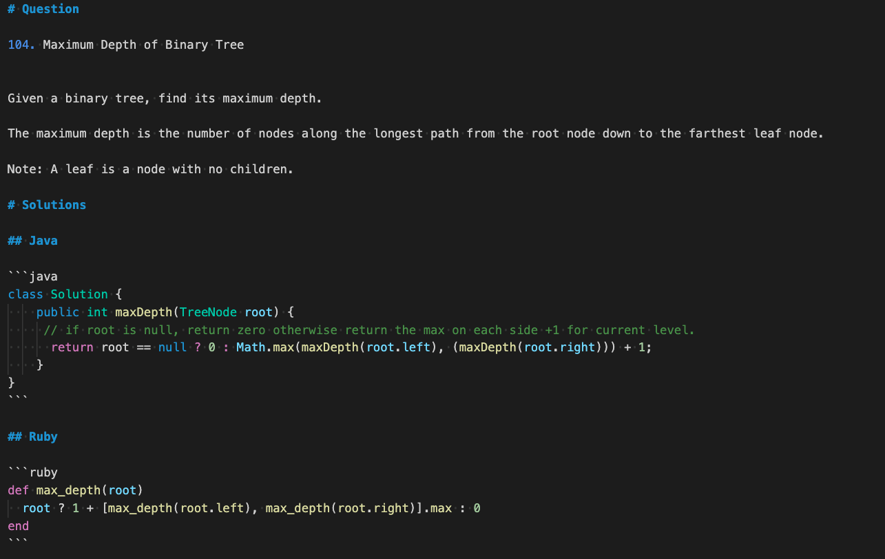

# One Line

This is just for fun. Probably not a good idea for real life or programming interview if logic is not simple.

## Contributing:
Please follow the following guidelines for contrubuting.

1. Fork this repo.
2. Clone forked repo to your machine.
3. Create a branch(or work on master/main).
4. Make changes. Make sure changes follows the style guideslines.
5. Push the changes to your repo.
6. Create a Pull Request.

## Style Guidelines:
- **Folders** are named using the website name: 
  Example: LeetCode.com -> leetcode
- **Files** should be named <Question_Number><Name_of_the_question>.md
- File should have following template:

  
